# FILE VERSION: 0.0.1

# Online markview (.md) files viewer
- **View .md files**: [https://markdownlivepreview.dev/](https://markdownlivepreview.dev/)

# Software Industry Roles: A Comparison

While the lines between these roles are often blurred in the workplace, they can be distinguished by their scope of responsibility and the "size" of the problems they solve.

---

## 1. Visual Hierarchy (Mermaid.js)

The following diagram shows how each role builds upon the other. A Software Engineer typically encompasses the skills of a Developer and a Programmer, but with an added focus on system-wide architecture.

```mermaid
graph TD
    subgraph SE ["🏙️ Software Engineer (The Architect)"]
        direction TB
        SE_Focus["Scalability, Reliability & Architecture"]
        SE_Mind["How will this system behave under load?"]
        
        subgraph SD ["🏠 Software Developer (The Creator)"]
            direction TB
            SD_Focus["Features & User Experience"]
            SD_Mind["How do I build a product that solves the problem?"]
            
            subgraph P ["🧱 Programmer (The Specialist)"]
                direction TB
                P_Focus["Logic, Algorithms & Syntax"]
                P_Mind["How do I make this function work?"]
            end
        end
    end

    style P fill:#f9f,stroke:#333,stroke-width:2px
    style SD fill:#bbf,stroke:#333,stroke-width:2px
    style SE fill:#dfd,stroke:#333,stroke-width:2px
    style P_Focus fill:#fff,stroke:#333
    style SD_Focus fill:#fff,stroke:#333
    style SE_Focus fill:#fff,stroke:#333
    style P_Mind fill:#ffe,stroke:#999,stroke-dasharray:3
    style SD_Mind fill:#ffe,stroke:#999,stroke-dasharray:3
    style SE_Mind fill:#ffe,stroke:#999,stroke-dasharray:3
```

---

## 2. Role Breakdowns

### **The Programmer** (The Specialist)

* **Core Task:** Translating logic into machine-readable code.
* **Focus:** Algorithms, syntax, and specific technical tasks.
* **Mindset:** "How do I make this specific function work?"

### **The Software Developer** (The Creator)

* **Core Task:** Building a complete, functional product.
* **Focus:** User requirements, frontend/backend integration, and feature sets.
* **Mindset:** "How do I build a product that solves the user's problem?"

### **The Software Engineer** (The Architect)

* **Core Task:** Applying engineering principles to large-scale systems.
* **Focus:** Reliability, system performance, infrastructure, and scalability.
* **Mindset:** "How will this system behave under heavy load and maintainability over years?"

---

## 3. Comparison Summary

| Feature | Programmer | Developer | Software Engineer |
| --- | --- | --- | --- |
| **Primary Goal** | Write executable code | Create a functional app | Design a robust system |
| **Main Concern** | Logic & Syntax | Features & UX | Scalability & Reliability |
| **Perspective** | Micro (The code block) | Mid-range (The application) | Macro (The ecosystem) |
| **Analogy** | The Bricklayer | The House Builder | The Urban Planner |