# FILE VERSION: 0.0.1

# Technical Career Ladder: Role Progression

Understanding the different levels and leadership paths in software development helps you navigate your career effectively.

---

## 1. Career Path Overview (Mermaid.js)

```mermaid
%%{init: {'flowchart': {'padding': 20, 'htmlLabels': true}}}%%
graph LR
    subgraph IC ["🧑‍💻 Individual Contributor Track"]
        direction TB
        Junior["Junior Developer"]
        Mid["Mid-Level Developer"]
        Senior["Senior Developer"]
        Staff["Staff Engineer"]
        Principal["Principal Engineer"]
        
        Junior --> Mid --> Senior --> Staff --> Principal
    end
    
    subgraph Lead ["👥 Leadership Track"]
        direction TB
        TechLead["Tech Lead"]
        EM["Engineering Manager"]
        Director["Director of Engineering"]
        VP["VP of Engineering"]
        CTO["CTO"]
        
        TechLead --> EM --> Director --> VP --> CTO
    end
    
    Senior -.-> TechLead
    Staff -.-> EM

    style Junior fill:#fcd34d,stroke:#b45309,stroke-width:2px,color:#78350f
    style Mid fill:#fbbf24,stroke:#b45309,stroke-width:2px,color:#78350f
    style Senior fill:#f59e0b,stroke:#92400e,stroke-width:2px,color:#78350f
    style Staff fill:#d97706,stroke:#92400e,stroke-width:2px,color:#fff
    style Principal fill:#b45309,stroke:#78350f,stroke-width:2px,color:#fff
    
    style TechLead fill:#67e8f9,stroke:#0891b2,stroke-width:2px,color:#164e63
    style EM fill:#22d3ee,stroke:#0891b2,stroke-width:2px,color:#164e63
    style Director fill:#06b6d4,stroke:#0e7490,stroke-width:2px,color:#fff
    style VP fill:#0891b2,stroke:#155e75,stroke-width:2px,color:#fff
    style CTO fill:#0e7490,stroke:#164e63,stroke-width:2px,color:#fff
    
    style IC fill:#fef3c7,stroke:#f59e0b,stroke-width:2px
    style Lead fill:#cffafe,stroke:#06b6d4,stroke-width:2px
```

---

## 2. Individual Contributor (IC) Track

### 🟡 Junior Developer (0-2 years)

| Aspect | Description |
|--------|-------------|
| **Focus** | Learning fundamentals, completing assigned tasks |
| **Scope** | Single tasks or small features |
| **Independence** | Requires regular guidance and code reviews |
| **Key Skills** | Basic coding, debugging, following patterns |
| **Mindset** | "How do I complete this task correctly?" |

---

### 🟠 Mid-Level Developer (2-5 years)

| Aspect | Description |
|--------|-------------|
| **Focus** | Delivering features independently |
| **Scope** | Complete features, small projects |
| **Independence** | Works autonomously with occasional guidance |
| **Key Skills** | System design basics, mentoring juniors, debugging complex issues |
| **Mindset** | "How do I build this feature the right way?" |

---

### 🟠 Senior Developer (5-8+ years)

| Aspect | Description |
|--------|-------------|
| **Focus** | Technical excellence, mentoring, architectural decisions |
| **Scope** | Multiple features, entire components |
| **Independence** | Fully autonomous, guides others |
| **Key Skills** | System design, code review expertise, cross-team collaboration |
| **Mindset** | "How do we build this system to be maintainable and scalable?" |

---

### 🟤 Staff Engineer (8-12+ years)

| Aspect | Description |
|--------|-------------|
| **Focus** | Cross-team technical leadership, setting standards |
| **Scope** | Multiple teams, entire systems |
| **Independence** | Defines technical direction |
| **Key Skills** | Architecture at scale, influencing without authority, technical strategy |
| **Mindset** | "How do we solve organization-wide technical challenges?" |

---

### 🟤 Principal Engineer (12+ years)

| Aspect | Description |
|--------|-------------|
| **Focus** | Company-wide technical vision and strategy |
| **Scope** | Entire organization, industry influence |
| **Independence** | Sets the technical agenda |
| **Key Skills** | Industry expertise, executive communication, long-term planning |
| **Mindset** | "What technical direction should the company take?" |

---

## 3. Leadership Track

### 🔵 Tech Lead

| Aspect | Description |
|--------|-------------|
| **Focus** | Technical direction of a single team |
| **Responsibilities** | Code reviews, architecture decisions, unblocking developers |
| **Coding** | Still writes code (50-70% of time) |
| **Reports To** | Engineering Manager |
| **Key Difference** | Technical authority, not people management |

---

### 🔵 Engineering Manager (EM)

| Aspect | Description |
|--------|-------------|
| **Focus** | People management, team performance |
| **Responsibilities** | Hiring, 1:1s, performance reviews, career development |
| **Coding** | Little to no coding |
| **Reports To** | Director of Engineering |
| **Key Difference** | Manages people, not just code |

---

### 🔵 Director of Engineering

| Aspect | Description |
|--------|-------------|
| **Focus** | Multiple teams, department-level strategy |
| **Responsibilities** | Resource allocation, cross-team coordination, hiring strategy |
| **Coding** | Rarely codes |
| **Reports To** | VP of Engineering |
| **Key Difference** | Manages managers, sets processes |

---

### 🔵 VP of Engineering

| Aspect | Description |
|--------|-------------|
| **Focus** | Engineering organization strategy |
| **Responsibilities** | Budget, organizational structure, executive reporting |
| **Coding** | Never codes |
| **Reports To** | CTO or CEO |
| **Key Difference** | Business + technical alignment |

---

### 🔵 CTO (Chief Technology Officer)

| Aspect | Description |
|--------|-------------|
| **Focus** | Company-wide technology vision |
| **Responsibilities** | Technology strategy, innovation, external representation |
| **Coding** | Never codes (may prototype occasionally) |
| **Reports To** | CEO / Board |
| **Key Difference** | Technology as a business advantage |

---

## 4. Key Transitions Summary

```mermaid
%%{init: {'flowchart': {'padding': 15}}}%%
graph TB
    subgraph Transitions ["🔄 Critical Career Transitions"]
        T1["Junior → Mid: From learning to delivering"]
        T2["Mid → Senior: From features to systems thinking"]
        T3["Senior → Staff: From team to org impact"]
        T4["Senior → Tech Lead: From IC to technical leadership"]
        T5["Tech Lead → EM: From code to people"]
    end
    
    style T1 fill:#fef3c7,stroke:#f59e0b,color:#92400e
    style T2 fill:#fed7aa,stroke:#f97316,color:#9a3412
    style T3 fill:#ffedd5,stroke:#fb923c,color:#9a3412
    style T4 fill:#cffafe,stroke:#06b6d4,color:#0e7490
    style T5 fill:#a5f3fc,stroke:#22d3ee,color:#0e7490
    style Transitions fill:#f0fdf4,stroke:#22c55e,stroke-width:2px
```

---

## 5. Comparison Table

| Level | Scope | Autonomy | Primary Output | Measures Success By |
|-------|-------|----------|----------------|---------------------|
| **Junior** | Tasks | Low | Working code | Tasks completed |
| **Mid** | Features | Medium | Shipped features | Feature quality |
| **Senior** | Components | High | Technical leadership | Team productivity |
| **Staff** | Systems | Very High | Technical strategy | Org-wide impact |
| **Principal** | Company | Full | Vision & direction | Business outcomes |
| **Tech Lead** | Team tech | High | Architecture | Team velocity |
| **EM** | Team people | High | Team health | Retention & growth |
| **Director** | Department | Very High | Process & strategy | Department output |
| **VP** | Organization | Full | Org structure | Engineering success |
| **CTO** | Company tech | Full | Tech vision | Competitive advantage |
