# FILE VERSION: 0.0.1

# Business & Management Roles in Tech

Understanding the non-technical roles that drive software projects helps engineers collaborate effectively across the organization.

---

## 1. Role Ecosystem Overview (Mermaid.js)

```mermaid
%%{init: {'flowchart': {'padding': 20, 'htmlLabels': true}}}%%
graph TB
    subgraph Exec ["🏢 Executive Level"]
        CEO["CEO"]
        COO["COO"]
        CPO["CPO"]
    end
    
    subgraph Product ["📦 Product Track"]
        direction TB
        APM["Associate PM"]
        PM["Product Manager"]
        SPM["Senior PM"]
        GPM["Group PM"]
        DPM["Director of Product"]
        VPP["VP of Product"]
        
        APM --> PM --> SPM --> GPM --> DPM --> VPP
    end
    
    subgraph Project ["📋 Project Track"]
        direction TB
        PC["Project Coordinator"]
        PjM["Project Manager"]
        SPjM["Senior PM"]
        PMO["PMO Lead"]
        DPj["Director of PMO"]
        
        PC --> PjM --> SPjM --> PMO --> DPj
    end
    
    subgraph Design ["🎨 Design Track"]
        direction TB
        JD["Junior Designer"]
        UXD["UX Designer"]
        SUD["Senior UX Designer"]
        LD["Lead Designer"]
        DD["Design Director"]
        
        JD --> UXD --> SUD --> LD --> DD
    end
    
    VPP --> CPO
    DPj --> COO
    DD --> CPO

    style CEO fill:#a855f7,stroke:#7c3aed,stroke-width:2px,color:#fff
    style COO fill:#a855f7,stroke:#7c3aed,stroke-width:2px,color:#fff
    style CPO fill:#a855f7,stroke:#7c3aed,stroke-width:2px,color:#fff
    
    style APM fill:#86efac,stroke:#22c55e,stroke-width:2px,color:#166534
    style PM fill:#4ade80,stroke:#22c55e,stroke-width:2px,color:#166534
    style SPM fill:#22c55e,stroke:#16a34a,stroke-width:2px,color:#fff
    style GPM fill:#16a34a,stroke:#15803d,stroke-width:2px,color:#fff
    style DPM fill:#15803d,stroke:#166534,stroke-width:2px,color:#fff
    style VPP fill:#166534,stroke:#14532d,stroke-width:2px,color:#fff
    
    style PC fill:#fca5a5,stroke:#ef4444,stroke-width:2px,color:#991b1b
    style PjM fill:#f87171,stroke:#ef4444,stroke-width:2px,color:#fff
    style SPjM fill:#ef4444,stroke:#dc2626,stroke-width:2px,color:#fff
    style PMO fill:#dc2626,stroke:#b91c1c,stroke-width:2px,color:#fff
    style DPj fill:#b91c1c,stroke:#991b1b,stroke-width:2px,color:#fff
    
    style JD fill:#c4b5fd,stroke:#8b5cf6,stroke-width:2px,color:#5b21b6
    style UXD fill:#a78bfa,stroke:#8b5cf6,stroke-width:2px,color:#fff
    style SUD fill:#8b5cf6,stroke:#7c3aed,stroke-width:2px,color:#fff
    style LD fill:#7c3aed,stroke:#6d28d9,stroke-width:2px,color:#fff
    style DD fill:#6d28d9,stroke:#5b21b6,stroke-width:2px,color:#fff
    
    style Exec fill:#f3e8ff,stroke:#a855f7,stroke-width:2px
    style Product fill:#dcfce7,stroke:#22c55e,stroke-width:2px
    style Project fill:#fee2e2,stroke:#ef4444,stroke-width:2px
    style Design fill:#ede9fe,stroke:#8b5cf6,stroke-width:2px
```

---

## 2. Product Track

### 🟢 Product Manager (PM)

| Aspect | Description |
|--------|-------------|
| **Focus** | What to build and why |
| **Responsibilities** | Product vision, roadmap, prioritization, stakeholder management |
| **Works With** | Engineers, designers, customers, business |
| **Key Skills** | User empathy, data analysis, communication, strategy |
| **Mindset** | "What problem are we solving for users?" |

```mermaid
%%{init: {'flowchart': {'padding': 10}}}%%
graph LR
    subgraph PM_Work ["Product Manager's World"]
        Users["👥 Users"] --> PM["📦 PM"]
        Business["💼 Business"] --> PM
        PM --> Roadmap["🗺️ Roadmap"]
        PM --> Specs["📝 Requirements"]
        Roadmap --> Engineers["👨‍💻 Engineers"]
        Specs --> Engineers
    end
    
    style PM fill:#22c55e,stroke:#16a34a,stroke-width:2px,color:#fff
    style PM_Work fill:#dcfce7,stroke:#22c55e,stroke-width:2px
```

---

### 🟢 Product Manager Career Ladder

| Level | Scope | Key Responsibilities |
|-------|-------|---------------------|
| **Associate PM** | Features | Learn the craft, support senior PMs |
| **Product Manager** | Product area | Own a product area, define roadmap |
| **Senior PM** | Multiple areas | Strategic planning, mentor PMs |
| **Group PM** | Product line | Coordinate multiple PMs |
| **Director of Product** | Department | Product strategy, team building |
| **VP of Product** | Company | Company-wide product vision |
| **CPO** | Organization | Product as competitive advantage |

---

## 3. Project Track

### 🔴 Project Manager (PjM)

| Aspect | Description |
|--------|-------------|
| **Focus** | How and when to deliver |
| **Responsibilities** | Timelines, resources, risks, dependencies |
| **Works With** | All teams involved in delivery |
| **Key Skills** | Planning, communication, risk management, tools (Jira, etc.) |
| **Mindset** | "How do we deliver this on time and within budget?" |

---

### 🔴 Product Manager vs Project Manager

```mermaid
%%{init: {'flowchart': {'padding': 15}}}%%
graph TB
    subgraph Comparison ["PM vs PjM"]
        direction LR
        subgraph ProductM ["📦 Product Manager"]
            PM_Q1["WHAT to build"]
            PM_Q2["WHY we build it"]
            PM_Q3["Product success"]
        end
        
        subgraph ProjectM ["📋 Project Manager"]
            PjM_Q1["HOW to deliver"]
            PjM_Q2["WHEN to deliver"]
            PjM_Q3["Project success"]
        end
    end
    
    style ProductM fill:#dcfce7,stroke:#22c55e,stroke-width:2px
    style ProjectM fill:#fee2e2,stroke:#ef4444,stroke-width:2px
    style Comparison fill:#f8fafc,stroke:#94a3b8,stroke-width:2px
```

| Aspect | Product Manager | Project Manager |
|--------|-----------------|-----------------|
| **Primary Question** | What should we build? | How do we deliver it? |
| **Success Metric** | User adoption, revenue | On-time, on-budget delivery |
| **Time Horizon** | Long-term (quarters/years) | Short-term (sprints/months) |
| **Main Output** | Roadmap, PRDs | Gantt charts, status reports |
| **Key Relationship** | Customers & stakeholders | Cross-functional teams |

---

## 4. Design Track

### 🟣 UX Designer

| Aspect | Description |
|--------|-------------|
| **Focus** | User experience and interface design |
| **Responsibilities** | User research, wireframes, prototypes, usability testing |
| **Works With** | Product, engineering, users |
| **Key Skills** | Design tools (Figma), research, empathy, visual design |
| **Mindset** | "How do users interact with this product?" |

---

### 🟣 UX Designer Career Ladder

| Level | Scope | Key Responsibilities |
|-------|-------|---------------------|
| **Junior Designer** | Screens | Execute designs, learn patterns |
| **UX Designer** | Features | End-to-end feature design |
| **Senior UX Designer** | Product areas | Design systems, mentor |
| **Lead Designer** | Product | Design direction, strategy |
| **Design Director** | Organization | Design culture, hiring |

---

## 5. Other Key Roles

### 📊 Business Analyst (BA)

| Aspect | Description |
|--------|-------------|
| **Focus** | Requirements gathering and documentation |
| **Responsibilities** | Stakeholder interviews, process mapping, specifications |
| **Works With** | Business stakeholders, developers, QA |
| **Key Skills** | Analysis, documentation, communication |
| **Mindset** | "What exactly does the business need?" |

---

### 🎯 Scrum Master

| Aspect | Description |
|--------|-------------|
| **Focus** | Agile process facilitation |
| **Responsibilities** | Sprint ceremonies, removing blockers, team coaching |
| **Works With** | Development team, Product Owner |
| **Key Skills** | Facilitation, coaching, conflict resolution |
| **Mindset** | "How can I help the team be more effective?" |

---

### 👔 Product Owner (PO)

| Aspect | Description |
|--------|-------------|
| **Focus** | Backlog management and sprint priorities |
| **Responsibilities** | User stories, acceptance criteria, sprint planning |
| **Works With** | Scrum team, stakeholders |
| **Key Skills** | Prioritization, user stories, communication |
| **Mindset** | "What should we build next?" |

> **Note:** In many organizations, Product Owner is a subset of Product Manager responsibilities.

---

## 6. How Roles Interact

```mermaid
%%{init: {'flowchart': {'padding': 15}}}%%
graph TB
    subgraph Collaboration ["🤝 Role Collaboration"]
        Customer["👥 Customer"]
        PM["📦 Product Manager"]
        PjM["📋 Project Manager"]
        UX["🎨 UX Designer"]
        Tech["👨‍💻 Tech Lead"]
        Dev["⌨️ Developers"]
        
        Customer -->|"needs"| PM
        PM -->|"what to build"| UX
        PM -->|"priorities"| PjM
        UX -->|"designs"| Tech
        PjM -->|"timelines"| Tech
        Tech -->|"tasks"| Dev
        Dev -->|"delivers"| Customer
    end
    
    style Customer fill:#e0e7ff,stroke:#6366f1,stroke-width:2px,color:#3730a3
    style PM fill:#22c55e,stroke:#16a34a,stroke-width:2px,color:#fff
    style PjM fill:#ef4444,stroke:#dc2626,stroke-width:2px,color:#fff
    style UX fill:#8b5cf6,stroke:#7c3aed,stroke-width:2px,color:#fff
    style Tech fill:#06b6d4,stroke:#0891b2,stroke-width:2px,color:#fff
    style Dev fill:#fbbf24,stroke:#f59e0b,stroke-width:2px,color:#78350f
    style Collaboration fill:#f8fafc,stroke:#94a3b8,stroke-width:2px
```

---

## 7. Summary Comparison

| Role | Core Question | Primary Focus | Success Metric |
|------|---------------|---------------|----------------|
| **Product Manager** | What & Why? | User needs, strategy | User adoption |
| **Project Manager** | How & When? | Delivery, resources | On-time delivery |
| **UX Designer** | How it feels? | User experience | Usability scores |
| **Business Analyst** | What exactly? | Requirements | Spec accuracy |
| **Scrum Master** | How to improve? | Team process | Team velocity |
| **Tech Lead** | How to build? | Architecture | Code quality |
