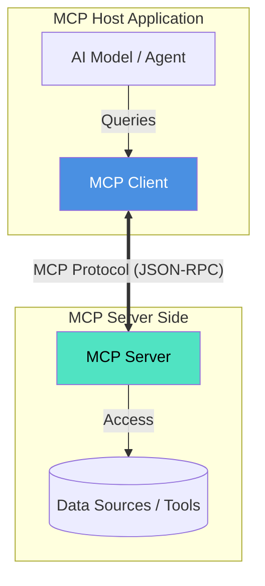
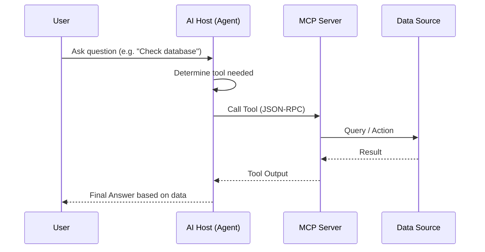

# FILE VERSION: 0.0.1

# Model Context Protocol (MCP)

## What is MCP?

The **Model Context Protocol (MCP)** is an open standard that enables AI models to securely connect to data sources and tools. It solves the problem of isolated AI models by providing a universal way to link them with context—files, databases, APIs, and other systems—without building custom integrations for every single service.

Think of MCP like a **USB-C port for AI applications**. Instead of needing a specific cable for every device, you have a standard connection that works across different tools and environments.

## How It Works

MCP uses a **Client-Host-Server** architecture:

1.  **MCP Host**: The application where the AI model lives (e.g., Claude Desktop, an IDE like VS Code or JetBrains, or a custom AI agent). The host initiates connections.
2.  **MCP Client**: A component within the host that maintains connections to servers.
3.  **MCP Server**: A lightweight program that exposes data and capabilities from a specific source (like Google Drive, a local file system, GitHub, or a PostgreSQL database) via the standardized protocol.
4.  **Local Resources**: The actual data or tools the server provides access to.



### Communication

MCP supports two main transport layers:
-   **Stdio**: Great for local processes (e.g., a server running on your machine).
-   **SSE (Server-Sent Events)**: Ideal for remote servers over HTTP.

### Interaction Flow Example



## Key Concepts

-   **Resources**: File-like data that can be read by clients (e.g., documents, logs).
-   **Prompts**: Pre-defined templates that help users use the server's capabilities effectively.
-   **Tools**: Executable functions that can perform actions (e.g., "query database", "create issue").
-   **Sampling**: Allows servers to request completions from the host's LLM (enabling agentic workflows).

## How to Integrate with MCP

Integration typically happens in two ways: **Consuming** (using existing servers) or **Building** (creating your own server).

### 1. Using Existing MCP Servers (Configuration)

To connect an AI host to an MCP server, you typically modify a configuration file.

**Example: configuring `claude_desktop_config.json`:**

```json
{
  "mcpServers": {
    "filesystem": {
      "command": "npx",
      "args": ["-y", "@modelcontextprotocol/server-filesystem", "/type/path/here"]
    },
    "git": {
      "command": "python",
      "args": ["-m", "mcp_server_git", "--repository", "/path/to/repo"]
    }
  }
}
```

In this example:
-   We register a `filesystem` server that gives the AI access to a local directory.
-   We register a `git` server that lets the AI read repository history.

### 2. Building Your Own MCP Server

You can build servers using the official SDKs for **TypeScript** or **Python**.

**Example (TypeScript) - A simple "Hello World" Tool:**

1.  **Initialize project**:
    ```bash
    npm init -y
    npm install @modelcontextprotocol/sdk
    ```

2.  **Create server (`index.ts`)**:
    ```typescript
    import { McpServer } from "@modelcontextprotocol/sdk/server/mcp.js";
    import { StdioServerTransport } from "@modelcontextprotocol/sdk/server/stdio.js";
    import { z } from "zod";

    // Create server instance
    const server = new McpServer({
      name: "my-weather-server",
      version: "1.0.0"
    });

    // Add a tool
    server.tool(
      "get_weather",
      { city: z.string() },
      async ({ city }) => {
        return {
          content: [{ type: "text", text: `The weather in ${city} is sunny!` }]
        };
      }
    );

    // Connect transport
    const transport = new StdioServerTransport();
    await server.connect(transport);
    ```

3.  **Run it**:
    Users can now add your server to their config using `node index.js` (after building).

## Why Use MCP?

-   **Context-Aware AI**: Give your AI real-time access to your specific documents and database schemas.
-   **Security**: Servers run locally or in controlled environments; you control exactly what data is exposed.
-   **Portability**: Build a server once, and it works with any MCP-compliant client (Claude, Zee, etc.).
