# FILE VERSION: 0.0.1

# What is a Protocol?

A **protocol** is a set of **rules and conventions** that define how data is formatted, transmitted, and received between devices or systems over a network. Without protocols, computers would have no common language — communication would be impossible.

---

## 1. Real-World Analogy

Think of a protocol like the **rules of a phone call**. Every step in a phone call has a direct equivalent in network communication:

```mermaid
%%{init: {'theme': 'base', 'themeVariables': {'primaryColor': '#e0e7ff', 'primaryBorderColor': '#6366f1', 'lineColor': '#6366f1', 'textColor': '#1f2937', 'fontSize': '14px'}}}%%
sequenceDiagram
    participant A as 🧑 Person A
    participant B as 🧑‍💼 Person B

    rect rgb(219, 234, 254)
        Note over A,B: Step 1 — Start the Call<br/>🌐 = Client sends a CONNECTION REQUEST
        A->>B: 📞 Dials B's phone number
        B-->>A: 📱 Picks up and says "Hello?"
    end

    rect rgb(220, 252, 231)
        Note over A,B: Step 2 — Agree on a Language<br/>🌐 = Both sides agree on a DATA FORMAT
        A->>B: "Do you speak English?"
        B-->>A: "Yes, let's speak English!"
    end

    rect rgb(254, 243, 199)
        Note over A,B: Step 3 — Exchange Information<br/>🌐 = Data is SENT and RECEIVED
        A->>B: Speaks a message
        B-->>A: Responds with an answer
    end

    rect rgb(252, 231, 243)
        Note over A,B: Step 4 — Take Turns<br/>🌐 = Devices follow FLOW CONTROL rules
        Note over A: Waits for B to finish<br/>before speaking
        Note over B: Waits for A to finish<br/>before responding
    end

    rect rgb(254, 226, 226)
        Note over A,B: Step 5 — End the Call<br/>🌐 = Connection is TERMINATED GRACEFULLY
        A->>B: "Goodbye!"
        B-->>A: "Goodbye!"
    end
```

> 💡 If either side breaks the rules (e.g., A speaks Arabic but B only understands English), **communication fails** — just like what happens when two devices use **mismatched protocols**.

---

## 2. Why Do We Need Protocols?

```mermaid
%%{init: {'theme': 'base', 'themeVariables': {'primaryColor': '#e0e7ff', 'primaryBorderColor': '#6366f1', 'lineColor': '#6366f1', 'textColor': '#1f2937', 'fontSize': '14px'}}}%%
flowchart TD
    A["🤔 Without Protocols"] --> B["Device A sends data\n in Format X"]
    B --> C["Device B expects data\n in Format Y"]
    C --> D["❌ Communication Fails!\n No common agreement"]

    E["✅ With Protocols"] --> F["Device A & B agree\n on Format Z"]
    F --> G["Device A sends data\n in Format Z"]
    G --> H["Device B understands\n Format Z perfectly"]
    H --> I["✅ Communication Succeeds!"]

    style A fill:#fee2e2,stroke:#ef4444,stroke-width:2px,color:#991b1b
    style B fill:#fecaca,stroke:#dc2626,color:#991b1b
    style C fill:#fecaca,stroke:#dc2626,color:#991b1b
    style D fill:#fee2e2,stroke:#ef4444,stroke-width:2px,color:#991b1b
    style E fill:#dcfce7,stroke:#22c55e,stroke-width:2px,color:#166534
    style F fill:#bbf7d0,stroke:#16a34a,color:#166534
    style G fill:#bbf7d0,stroke:#16a34a,color:#166534
    style H fill:#bbf7d0,stroke:#16a34a,color:#166534
    style I fill:#dcfce7,stroke:#22c55e,stroke-width:2px,color:#166534
```

Protocols solve these fundamental problems:

| Problem | How Protocols Solve It |
| ------- | ---------------------- |
| **Interoperability** | Different devices from different vendors can communicate using the same rules |
| **Data Integrity** | Ensure data arrives correctly without corruption |
| **Order & Sequencing** | Guarantee data arrives in the right order |
| **Error Handling** | Define what happens when something goes wrong |
| **Security** | Establish encryption and authentication standards |

---

## 3. Key Elements of a Protocol

Every protocol defines the following core elements:

```mermaid
%%{init: {'theme': 'base', 'themeVariables': {'primaryColor': '#dbeafe', 'primaryBorderColor': '#3b82f6', 'lineColor': '#3b82f6', 'textColor': '#1f2937', 'fontSize': '14px'}}}%%
flowchart LR
    subgraph PROTOCOL ["📜 Protocol Definition"]
        direction TB
        P1["📐 Syntax\n(Data format & structure)"]
        P2["📖 Semantics\n(Meaning of each field)"]
        P3["⏱️ Timing\n(When & how fast to send)"]
    end

    style PROTOCOL fill:#dbeafe,stroke:#3b82f6,stroke-width:2px,color:#1e3a5f
    style P1 fill:#bfdbfe,stroke:#3b82f6,color:#1e3a5f
    style P2 fill:#bfdbfe,stroke:#3b82f6,color:#1e3a5f
    style P3 fill:#bfdbfe,stroke:#3b82f6,color:#1e3a5f
```

| Element | What It Defines | Example |
| ------- | --------------- | ------- |
| **Syntax** | The structure/format of data (headers, fields, delimiters) | HTTP request: `GET /index.html HTTP/1.1` |
| **Semantics** | The meaning of each part of the data | `GET` = retrieve a resource, `200` = success |
| **Timing** | When to send, how long to wait, speed of transmission | TCP timeout = 30 seconds, retry after 3 seconds |

---

## 4. The OSI Model — Protocols at Every Layer

Protocols operate at different **layers** of network communication. The **OSI (Open Systems Interconnection)** model organizes them into 7 layers:

```mermaid
%%{init: {'theme': 'base', 'themeVariables': {'primaryColor': '#e0e7ff', 'primaryBorderColor': '#6366f1', 'lineColor': '#6366f1', 'textColor': '#1f2937', 'fontSize': '14px'}}}%%
flowchart TB
    L7["Layer 7 — Application\n📧 HTTP, FTP, SMTP, DNS"]
    L6["Layer 6 — Presentation\n🔐 SSL/TLS, JPEG, ASCII"]
    L5["Layer 5 — Session\n🤝 NetBIOS, RPC"]
    L4["Layer 4 — Transport\n🚚 TCP, UDP"]
    L3["Layer 3 — Network\n🗺️ IP, ICMP, ARP"]
    L2["Layer 2 — Data Link\n🔗 Ethernet, Wi-Fi (802.11)"]
    L1["Layer 1 — Physical\n⚡ USB, Bluetooth, Fiber Optic"]

    L7 --> L6 --> L5 --> L4 --> L3 --> L2 --> L1

    style L7 fill:#dbeafe,stroke:#3b82f6,stroke-width:2px,color:#1e3a5f
    style L6 fill:#e0e7ff,stroke:#6366f1,stroke-width:2px,color:#312e81
    style L5 fill:#fce7f3,stroke:#ec4899,stroke-width:2px,color:#831843
    style L4 fill:#fef3c7,stroke:#d97706,stroke-width:2px,color:#92400e
    style L3 fill:#dcfce7,stroke:#22c55e,stroke-width:2px,color:#166534
    style L2 fill:#ffedd5,stroke:#f97316,stroke-width:2px,color:#9a3412
    style L1 fill:#f3e8ff,stroke:#a855f7,stroke-width:2px,color:#6b21a8
```

> 🔑 When you visit a website, **multiple protocols work together simultaneously** — HTTP (Layer 7) rides on TCP (Layer 4), which rides on IP (Layer 3), which rides on Ethernet (Layer 2).

---

## 5. Common Protocols You Use Every Day

| Protocol | Layer | Full Name | What It Does |
| -------- | ----- | --------- | ------------ |
| **HTTP** | 7 | HyperText Transfer Protocol | Loads web pages |
| **HTTPS** | 7 | HTTP Secure | Loads web pages with encryption |
| **FTP** | 7 | File Transfer Protocol | Transfers files between systems |
| **SMTP** | 7 | Simple Mail Transfer Protocol | Sends emails |
| **DNS** | 7 | Domain Name System | Translates domain names to IP addresses |
| **TCP** | 4 | Transmission Control Protocol | Reliable, ordered data delivery |
| **UDP** | 4 | User Datagram Protocol | Fast, unreliable data delivery |
| **IP** | 3 | Internet Protocol | Routes packets across networks |
| **ARP** | 3 | Address Resolution Protocol | Maps IP addresses to MAC addresses |
| **WebSocket** | 7 | — | Real-time, bidirectional communication |

---

## 6. How a Protocol Works — HTTP Example

Let's trace a real-world HTTP request to see a protocol in action:

```mermaid
%%{init: {'theme': 'base', 'themeVariables': {'primaryColor': '#dcfce7', 'primaryBorderColor': '#22c55e', 'lineColor': '#22c55e', 'textColor': '#1f2937', 'fontSize': '14px'}}}%%
sequenceDiagram
    participant U as 🧑‍💻 User (Browser)
    participant D as 🌐 DNS Server
    participant S as 🖥️ Web Server

    Note over U: User types:<br/>https://example.com

    rect rgb(219, 234, 254)
        Note over U,D: 1️⃣ DNS Resolution (DNS Protocol)
        U->>D: What is the IP of example.com?
        D-->>U: It's 93.184.216.34
    end

    rect rgb(254, 243, 199)
        Note over U,S: 2️⃣ TCP Handshake (TCP Protocol)
        U->>S: SYN — Can I connect?
        S-->>U: SYN-ACK — Yes, go ahead!
        U->>S: ACK — Great, we're connected!
    end

    rect rgb(220, 252, 231)
        Note over U,S: 3️⃣ HTTP Request/Response (HTTP Protocol)
        U->>S: GET / HTTP/1.1<br/>Host: example.com
        S-->>U: HTTP/1.1 200 OK<br/>Content-Type: text/html<br/><br/><html>...</html>
    end

    rect rgb(252, 231, 243)
        Note over U,S: 4️⃣ Connection Close (TCP Protocol)
        U->>S: FIN — I'm done
        S-->>U: ACK + FIN — Me too
        U->>S: ACK — Goodbye!
    end

    Note over U: ✅ Browser renders<br/>the web page
```

> 💡 Notice how **four protocols** (DNS, TCP, TLS, HTTP) worked together behind the scenes just to load a single web page!

---

## 7. Protocol Categories

Protocols can be classified in several ways:

```mermaid
%%{init: {'theme': 'base', 'themeVariables': {'primaryColor': '#e0e7ff', 'primaryBorderColor': '#6366f1', 'lineColor': '#6366f1', 'textColor': '#1f2937', 'fontSize': '14px'}}}%%
flowchart TD
    A["📜 Protocol Categories"] --> B["By Function"]
    A --> C["By State"]
    A --> D["By Connection"]

    B --> B1["📨 Communication\n(HTTP, FTP, SMTP)"]
    B --> B2["🔐 Security\n(TLS, SSH, IPSec)"]
    B --> B3["🗺️ Routing\n(BGP, OSPF, RIP)"]
    B --> B4["🌐 Name Resolution\n(DNS, mDNS)"]

    C --> C1["📭 Stateless\n(HTTP, DNS, UDP)"]
    C --> C2["📬 Stateful\n(FTP, SSH, TCP)"]

    D --> D1["🔗 Connection-Oriented\n(TCP, SSH)"]
    D --> D2["📡 Connectionless\n(UDP, IP)"]

    style A fill:#e0e7ff,stroke:#6366f1,stroke-width:2px,color:#312e81
    style B fill:#dbeafe,stroke:#3b82f6,stroke-width:2px,color:#1e3a5f
    style C fill:#dcfce7,stroke:#22c55e,stroke-width:2px,color:#166534
    style D fill:#fef3c7,stroke:#d97706,stroke-width:2px,color:#92400e
    style B1 fill:#bfdbfe,stroke:#3b82f6,color:#1e3a5f
    style B2 fill:#bfdbfe,stroke:#3b82f6,color:#1e3a5f
    style B3 fill:#bfdbfe,stroke:#3b82f6,color:#1e3a5f
    style B4 fill:#bfdbfe,stroke:#3b82f6,color:#1e3a5f
    style C1 fill:#bbf7d0,stroke:#16a34a,color:#166534
    style C2 fill:#bbf7d0,stroke:#16a34a,color:#166534
    style D1 fill:#fef3c7,stroke:#d97706,color:#92400e
    style D2 fill:#fef3c7,stroke:#d97706,color:#92400e
```

---

## 8. Protocol Encapsulation — How Data Travels

When data is sent, each layer **wraps** (encapsulates) it with its own header — like putting a letter inside an envelope, inside a package, inside a shipping box:

```mermaid
%%{init: {'theme': 'base', 'themeVariables': {'primaryColor': '#e0e7ff', 'primaryBorderColor': '#6366f1', 'lineColor': '#6366f1', 'textColor': '#1f2937', 'fontSize': '14px'}}}%%
flowchart LR
    D["📄 Data"] --> S["Application Layer\n(HTTP Header + Data)"]
    S --> T["Transport Layer\n(TCP Header + HTTP Header + Data)"]
    T --> N["Network Layer\n(IP Header + TCP Header + HTTP Header + Data)"]
    N --> L["Data Link Layer\n(Frame Header + IP Header + TCP Header + HTTP + Data + FCS)"]

    style D fill:#dbeafe,stroke:#3b82f6,stroke-width:2px,color:#1e3a5f
    style S fill:#dcfce7,stroke:#22c55e,stroke-width:2px,color:#166534
    style T fill:#fef3c7,stroke:#d97706,stroke-width:2px,color:#92400e
    style N fill:#fce7f3,stroke:#ec4899,stroke-width:2px,color:#831843
    style L fill:#f3e8ff,stroke:#a855f7,stroke-width:2px,color:#6b21a8
```

> 🔑 At the receiving end, each layer **removes** its header (de-encapsulation) and passes the data up to the next layer until the original data reaches the application.

---

## 9. Summary

```mermaid
%%{init: {'theme': 'base', 'themeVariables': {'primaryColor': '#e0e7ff', 'primaryBorderColor': '#6366f1', 'lineColor': '#6366f1', 'textColor': '#1f2937', 'fontSize': '14px'}}}%%
flowchart LR
    subgraph KEY ["🔑 Key Takeaways"]
        direction TB
        K1["A protocol is a set of RULES\n for communication"]
        K2["Protocols define SYNTAX,\n SEMANTICS, and TIMING"]
        K3["The OSI model organizes\n protocols into 7 layers"]
        K4["Multiple protocols work\n TOGETHER for every request"]
        K5["Each layer ENCAPSULATES\n data with its own headers"]
    end

    style KEY fill:#e0e7ff,stroke:#6366f1,stroke-width:2px,color:#312e81
    style K1 fill:#dcfce7,stroke:#22c55e,color:#166534
    style K2 fill:#dbeafe,stroke:#3b82f6,color:#1e3a5f
    style K3 fill:#fef3c7,stroke:#d97706,color:#92400e
    style K4 fill:#fce7f3,stroke:#ec4899,color:#831843
    style K5 fill:#dbeafe,stroke:#3b82f6,color:#1e3a5f
```

> 💡 **Protocols are the invisible foundation of all digital communication.** Every time you browse a website, send an email, or stream a video, dozens of protocols are working together behind the scenes to make it happen seamlessly.
