# FILE VERSION: 0.0.1

# CORS (Cross-Origin Resource Sharing)

CORS is a **security mechanism** built into web browsers that controls how web pages from one origin can request resources from a different origin. It extends and relaxes the **Same-Origin Policy (SOP)**.

---

## 1. What is an "Origin"?

An origin is defined by the combination of **three parts**:

| Part       | Example              |
| ---------- | -------------------- |
| **Scheme** | `https://`           |
| **Host**   | `api.example.com`    |
| **Port**   | `:443`               |

> 🔑 Two URLs have the **same origin** only if all three parts match exactly.

### Origin Comparison Examples

| URL A                          | URL B                          | Same Origin? | Reason            |
| ------------------------------ | ------------------------------ | ------------ | ----------------- |
| `https://example.com`          | `https://example.com/about`    | ✅ Yes       | Same scheme, host, port |
| `https://example.com`          | `http://example.com`           | ❌ No        | Different scheme  |
| `https://example.com`          | `https://api.example.com`      | ❌ No        | Different host    |
| `https://example.com`          | `https://example.com:8080`     | ❌ No        | Different port    |

---

## 2. The Problem: Same-Origin Policy (SOP)

Browsers enforce the **Same-Origin Policy** by default. Without CORS, a frontend app on one origin **cannot** read responses from a different origin.

```mermaid
%%{init: {'theme': 'base', 'themeVariables': {'primaryColor': '#fee2e2', 'primaryBorderColor': '#ef4444', 'lineColor': '#ef4444', 'textColor': '#1f2937', 'fontSize': '14px'}}}%%
sequenceDiagram
    participant B as 🌐 Browser<br/>(https://myapp.com)
    participant S as 🖥️ Server<br/>(https://api.other.com)

    B->>S: GET /data (Cross-Origin Request)
    S-->>B: 200 OK + Response Body

    Note over B: ❌ BLOCKED by Browser!<br/>No Access-Control-Allow-Origin<br/>header found in response.
    Note over B: JavaScript CANNOT<br/>read the response.
```

> ⚠️ **Important:** The server **does** receive and process the request. The **browser** is the one that blocks the JavaScript from reading the response.

---

## 3. The Solution: CORS Headers

The server can **opt-in** to sharing its resources with other origins by including specific CORS headers in the response.

```mermaid
%%{init: {'theme': 'base', 'themeVariables': {'primaryColor': '#dcfce7', 'primaryBorderColor': '#22c55e', 'lineColor': '#22c55e', 'textColor': '#1f2937', 'fontSize': '14px'}}}%%
sequenceDiagram
    participant B as 🌐 Browser<br/>(https://myapp.com)
    participant S as 🖥️ Server<br/>(https://api.other.com)

    B->>S: GET /data<br/>Origin: https://myapp.com
    S-->>B: 200 OK<br/>Access-Control-Allow-Origin: https://myapp.com

    Note over B: ✅ ALLOWED!<br/>Origin matches the<br/>allowed origin header.
    Note over B: JavaScript CAN<br/>read the response.
```

---

## 4. Simple vs. Preflight Requests

CORS classifies requests into two categories:

### Simple Request Conditions

A request is **"simple"** if it meets **all** of these criteria:

| Condition        | Allowed Values                                   |
| ---------------- | ------------------------------------------------ |
| **Method**       | `GET`, `POST`, `HEAD`                            |
| **Content-Type** | `text/plain`, `multipart/form-data`, `application/x-www-form-urlencoded` |
| **Headers**      | Only standard headers (`Accept`, `Accept-Language`, `Content-Language`, etc.) |

Anything outside these rules triggers a **Preflight Request**.

---

## 5. Preflight Request In Detail

When a request is **not simple** (e.g., `PUT`, `DELETE`, custom headers, or `Content-Type: application/json`), the browser automatically sends an `OPTIONS` request first.

```mermaid
%%{init: {'theme': 'base', 'themeVariables': {'primaryColor': '#fce7f3', 'primaryBorderColor': '#ec4899', 'lineColor': '#6366f1', 'textColor': '#1f2937', 'fontSize': '14px'}}}%%
sequenceDiagram
    participant B as 🌐 Browser<br/>(https://myapp.com)
    participant S as 🖥️ Server<br/>(https://api.other.com)

    Note over B: Wants to send:<br/>DELETE /users/5<br/>Authorization: Bearer xxx

    rect rgb(254, 243, 199)
        Note over B,S: 1️⃣ Preflight Phase (Automatic)
        B->>S: OPTIONS /users/5<br/>Origin: https://myapp.com<br/>Access-Control-Request-Method: DELETE<br/>Access-Control-Request-Headers: Authorization
        S-->>B: 204 No Content<br/>Access-Control-Allow-Origin: https://myapp.com<br/>Access-Control-Allow-Methods: GET, POST, DELETE<br/>Access-Control-Allow-Headers: Authorization<br/>Access-Control-Max-Age: 86400
    end

    rect rgb(220, 252, 231)
        Note over B,S: 2️⃣ Actual Request Phase
        B->>S: DELETE /users/5<br/>Origin: https://myapp.com<br/>Authorization: Bearer xxx
        S-->>B: 200 OK<br/>Access-Control-Allow-Origin: https://myapp.com
    end

    Note over B: ✅ Response readable<br/>by JavaScript
```

### Preflight Headers Explained

| Header (Request)                       | Purpose                                 |
| -------------------------------------- | --------------------------------------- |
| `Access-Control-Request-Method`        | Tells the server what HTTP method will be used |
| `Access-Control-Request-Headers`       | Tells the server what custom headers will be sent |

| Header (Response)                      | Purpose                                 |
| -------------------------------------- | --------------------------------------- |
| `Access-Control-Allow-Origin`          | Which origin(s) are allowed             |
| `Access-Control-Allow-Methods`         | Which HTTP methods are allowed          |
| `Access-Control-Allow-Headers`         | Which custom headers are allowed        |
| `Access-Control-Max-Age`              | How long (seconds) to cache the preflight result |

---

## 6. CORS with Credentials (Cookies / Auth)

By default, cross-origin requests **do not** include cookies or authentication. To enable this:

```mermaid
%%{init: {'theme': 'base', 'themeVariables': {'primaryColor': '#fef3c7', 'primaryBorderColor': '#d97706', 'lineColor': '#d97706', 'textColor': '#1f2937', 'fontSize': '14px'}}}%%
sequenceDiagram
    participant B as 🌐 Browser<br/>(https://myapp.com)
    participant S as 🖥️ Server<br/>(https://api.other.com)

    Note over B: fetch(url, {<br/>  credentials: 'include'<br/>})

    B->>S: GET /profile<br/>Origin: https://myapp.com<br/>Cookie: session=abc123

    S-->>B: 200 OK<br/>Access-Control-Allow-Origin: https://myapp.com<br/>Access-Control-Allow-Credentials: true

    Note over B: ✅ Cookies sent & response readable
```

> 🚨 **Critical Rule:** When `Access-Control-Allow-Credentials: true` is set, `Access-Control-Allow-Origin` **CANNOT** be `*` (wildcard). It **must** be the exact origin.

---

## 7. Complete CORS Flow Overview

```mermaid
%%{init: {'theme': 'base', 'themeVariables': {'primaryColor': '#e0e7ff', 'primaryBorderColor': '#6366f1', 'lineColor': '#6366f1', 'textColor': '#1f2937', 'fontSize': '14px'}}}%%
flowchart TD
    A["🌐 JavaScript makes<br/>an HTTP Request"] --> B{"Is it a<br/>Same-Origin request?"}

    B -->|"✅ Yes"| C["✅ No CORS needed.<br/>Request proceeds normally."]
    B -->|"❌ No (Cross-Origin)"| D{"Is it a<br/>Simple Request?"}

    D -->|"✅ Yes"| E["📨 Send request directly<br/>with Origin header"]
    D -->|"❌ No"| F["✈️ Send OPTIONS<br/>preflight first"]

    F --> G{"Server responds<br/>with CORS allow<br/>headers?"}
    G -->|"❌ No"| H["🚫 BLOCKED<br/>CORS Error in Console"]
    G -->|"✅ Yes"| I["📨 Send actual request<br/>with Origin header"]

    E --> J{"Response has<br/>Access-Control-Allow-Origin<br/>matching Origin?"}
    I --> J

    J -->|"❌ No"| H
    J -->|"✅ Yes"| K["✅ Response is accessible<br/>to JavaScript"]

    style A fill:#dbeafe,stroke:#3b82f6,stroke-width:2px,color:#1e3a5f
    style B fill:#fef3c7,stroke:#d97706,stroke-width:2px,color:#92400e
    style C fill:#dcfce7,stroke:#22c55e,stroke-width:2px,color:#166534
    style D fill:#fef3c7,stroke:#d97706,stroke-width:2px,color:#92400e
    style E fill:#dbeafe,stroke:#3b82f6,stroke-width:2px,color:#1e3a5f
    style F fill:#fce7f3,stroke:#ec4899,stroke-width:2px,color:#831843
    style G fill:#fef3c7,stroke:#d97706,stroke-width:2px,color:#92400e
    style H fill:#fee2e2,stroke:#ef4444,stroke-width:2px,color:#991b1b
    style I fill:#dbeafe,stroke:#3b82f6,stroke-width:2px,color:#1e3a5f
    style J fill:#fef3c7,stroke:#d97706,stroke-width:2px,color:#92400e
    style K fill:#dcfce7,stroke:#22c55e,stroke-width:2px,color:#166534
```

---

## 8. Key CORS Response Headers Summary

| Header                                 | Example Value                    | Description                              |
| -------------------------------------- | -------------------------------- | ---------------------------------------- |
| `Access-Control-Allow-Origin`          | `https://myapp.com` or `*`       | Specifies which origin can access the resource |
| `Access-Control-Allow-Methods`         | `GET, POST, PUT, DELETE`         | Specifies allowed HTTP methods           |
| `Access-Control-Allow-Headers`         | `Content-Type, Authorization`    | Specifies allowed custom headers         |
| `Access-Control-Allow-Credentials`     | `true`                           | Allows cookies/auth to be sent           |
| `Access-Control-Expose-Headers`        | `X-Custom-Header`               | Makes specific headers readable by JS    |
| `Access-Control-Max-Age`              | `86400`                          | Caches the preflight for N seconds       |

---

## 9. Common CORS Errors & Solutions

| Error                                                  | Cause                                          | Solution                                       |
| ------------------------------------------------------ | ---------------------------------------------- | ---------------------------------------------- |
| `No 'Access-Control-Allow-Origin' header`              | Server does not include CORS headers           | Add CORS middleware/headers on the server       |
| `Wildcard '*' cannot be used with credentials`         | Using `*` while `credentials: include` is set  | Set the exact origin instead of `*`             |
| `Method PUT is not allowed`                            | Server doesn't list `PUT` in allowed methods   | Add `PUT` to `Access-Control-Allow-Methods`     |
| `Request header 'Authorization' is not allowed`        | Custom header not listed in allowed headers     | Add `Authorization` to `Access-Control-Allow-Headers` |
| Preflight response has invalid HTTP status code        | Server returns error for `OPTIONS` request      | Handle `OPTIONS` requests properly on server    |

---

## 10. CORS is NOT Server Security

> 💡 **Remember:** CORS is enforced by the **browser**, not the server. It exists to protect **users** from malicious websites that try to steal data from other sites the user is logged into. Always implement proper **server-side authentication and authorization** regardless of CORS settings.
