# FILE VERSION: 0.0.1

# Stateful vs Stateless Protocols

A protocol's **statefulness** defines whether the server **remembers** previous interactions with a client. This fundamental design choice impacts scalability, reliability, and complexity of networked systems.

---

## 1. Core Concept

```mermaid
%%{init: {'theme': 'base', 'themeVariables': {'primaryColor': '#e0e7ff', 'primaryBorderColor': '#6366f1', 'lineColor': '#6366f1', 'textColor': '#1f2937', 'fontSize': '14px'}}}%%
flowchart LR
    subgraph STATELESS ["📭 Stateless Protocol"]
        direction TB
        SL1["Each request is<br/>independent & complete"]
        SL2["Server retains NO memory<br/>of previous requests"]
        SL3["Client must send ALL<br/>needed info every time"]
    end

    subgraph STATEFUL ["📬 Stateful Protocol"]
        direction TB
        SF1["Requests are part of<br/>an ongoing session"]
        SF2["Server REMEMBERS<br/>previous interactions"]
        SF3["Context carries over<br/>between requests"]
    end

    style STATELESS fill:#dcfce7,stroke:#22c55e,stroke-width:2px,color:#166534
    style STATEFUL fill:#dbeafe,stroke:#3b82f6,stroke-width:2px,color:#1e3a5f
    style SL1 fill:#bbf7d0,stroke:#16a34a,color:#166534
    style SL2 fill:#bbf7d0,stroke:#16a34a,color:#166534
    style SL3 fill:#bbf7d0,stroke:#16a34a,color:#166534
    style SF1 fill:#bfdbfe,stroke:#3b82f6,color:#1e3a5f
    style SF2 fill:#bfdbfe,stroke:#3b82f6,color:#1e3a5f
    style SF3 fill:#bfdbfe,stroke:#3b82f6,color:#1e3a5f
```

> 💡 Think of it this way: **Stateless** is like talking to a stranger every time — you must re-introduce yourself. **Stateful** is like talking to a friend — they already know who you are.

---

## 2. Stateless Protocol — How It Works

In a stateless protocol, every request from the client must contain **all the information** the server needs to fulfill it. The server does not store any context between requests.

### Example: HTTP (Stateless)

```mermaid
%%{init: {'theme': 'base', 'themeVariables': {'primaryColor': '#dcfce7', 'primaryBorderColor': '#22c55e', 'lineColor': '#22c55e', 'textColor': '#1f2937', 'fontSize': '14px'}}}%%
sequenceDiagram
    participant C as 🧑‍💻 Client
    participant S as 🖥️ Server

    Note over S: Server has NO memory<br/>of any previous request

    rect rgb(220, 252, 231)
        Note over C,S: Request 1
        C->>S: GET /products<br/>Authorization: Bearer token123
        S-->>C: 200 OK — List of products
    end

    Note over S: ❌ Immediately forgets<br/>everything about Request 1

    rect rgb(220, 252, 231)
        Note over C,S: Request 2
        C->>S: GET /products/42<br/>Authorization: Bearer token123
        S-->>C: 200 OK — Product #42 details
    end

    Note over S: ❌ Immediately forgets<br/>everything about Request 2

    Note over C: Client must send the<br/>auth token EVERY time
```

> 🔑 **Key Insight:** The client re-sends the `Authorization` header with every request because the server does not remember who the client is.

### Common Stateless Protocols

| Protocol | Use Case                       |
| -------- | ------------------------------ |
| **HTTP** | Web browsing, REST APIs        |
| **DNS**  | Domain name resolution         |
| **UDP**  | Streaming, gaming, VoIP        |
| **IP**   | Packet routing across networks |

---

## 3. Stateful Protocol — How It Works

In a stateful protocol, the server **maintains a session** and remembers the state of each connected client. Each request is interpreted in the **context** of previous requests.

### Example: FTP (Stateful)

```mermaid
%%{init: {'theme': 'base', 'themeVariables': {'primaryColor': '#dbeafe', 'primaryBorderColor': '#3b82f6', 'lineColor': '#3b82f6', 'textColor': '#1f2937', 'fontSize': '14px'}}}%%
sequenceDiagram
    participant C as 🧑‍💻 Client
    participant S as 🖥️ FTP Server

    rect rgb(219, 234, 254)
        Note over C,S: 1️⃣ Establish Session
        C->>S: Connect + Login (user: admin)
        S-->>C: 230 Login successful
        Note over S: ✅ Remembers:<br/>User = admin<br/>Directory = /root
    end

    rect rgb(219, 234, 254)
        Note over C,S: 2️⃣ Navigate (depends on session state)
        C->>S: CD /uploads
        S-->>C: 250 Directory changed
        Note over S: ✅ Updates state:<br/>Directory = /uploads
    end

    rect rgb(219, 234, 254)
        Note over C,S: 3️⃣ Action (depends on previous state)
        C->>S: LIST
        S-->>C: Files in /uploads (NOT /root!)
        Note over S: Server knew the current<br/>directory from step 2
    end

    rect rgb(254, 226, 226)
        Note over C,S: 4️⃣ Session Ends
        C->>S: QUIT
        S-->>C: 221 Goodbye
        Note over S: ❌ Session state destroyed
    end
```

> 🔑 **Key Insight:** The `LIST` command in step 3 does NOT specify which directory — the server **already knows** from the previous `CD` command. This is state.

### Common Stateful Protocols

| Protocol       | Use Case                           |
| -------------- | ---------------------------------- |
| **FTP**        | File transfer with sessions        |
| **SSH**        | Secure remote shell sessions       |
| **TCP**        | Reliable data transmission         |
| **WebSocket**  | Real-time bidirectional communication |
| **SMTP**       | Email sending (session-based)      |

---

## 4. Side-by-Side Comparison

```mermaid
%%{init: {'theme': 'base', 'themeVariables': {'primaryColor': '#e0e7ff', 'primaryBorderColor': '#6366f1', 'lineColor': '#6366f1', 'textColor': '#1f2937', 'fontSize': '14px'}}}%%
flowchart LR
    subgraph SL ["📭 Stateless"]
        direction TB
        SL_R1["Request 1:<br/>GET /cart<br/>Token: abc"] --> SL_S["🖥️ Server<br/>(No Memory)"]
        SL_R2["Request 2:<br/>GET /cart<br/>Token: abc"] --> SL_S
        SL_R3["Request 3:<br/>GET /cart<br/>Token: abc"] --> SL_S
    end

    subgraph SF ["📬 Stateful"]
        direction TB
        SF_R1["Request 1:<br/>Login"] --> SF_S["🖥️ Server<br/>(Has Session)"]
        SF_R2["Request 2:<br/>GET /cart"] --> SF_S
        SF_R3["Request 3:<br/>GET /cart"] --> SF_S
    end

    style SL fill:#dcfce7,stroke:#22c55e,stroke-width:2px,color:#166534
    style SF fill:#dbeafe,stroke:#3b82f6,stroke-width:2px,color:#1e3a5f
    style SL_S fill:#bbf7d0,stroke:#16a34a,color:#166534
    style SF_S fill:#bfdbfe,stroke:#3b82f6,color:#1e3a5f
    style SL_R1 fill:#f0fdf4,stroke:#22c55e,color:#166534
    style SL_R2 fill:#f0fdf4,stroke:#22c55e,color:#166534
    style SL_R3 fill:#f0fdf4,stroke:#22c55e,color:#166534
    style SF_R1 fill:#eff6ff,stroke:#3b82f6,color:#1e3a5f
    style SF_R2 fill:#eff6ff,stroke:#3b82f6,color:#1e3a5f
    style SF_R3 fill:#eff6ff,stroke:#3b82f6,color:#1e3a5f
```

> Notice how **stateless** requests always carry the token, while **stateful** requests rely on the server remembering the login from Request 1.

---

## 5. Comparison Table

| Feature                  | Stateless                          | Stateful                             |
| ------------------------ | ---------------------------------- | ------------------------------------ |
| **Server Memory**        | No session stored                  | Session stored per client            |
| **Each Request**         | Self-contained & independent       | Depends on previous requests         |
| **Scalability**          | ✅ Easy — any server can handle any request | ⚠️ Hard — requests tied to specific server |
| **Fault Tolerance**      | ✅ Server crash = no data loss     | ❌ Server crash = session lost       |
| **Load Balancing**       | ✅ Simple round-robin works        | ⚠️ Needs sticky sessions            |
| **Bandwidth**            | ⚠️ Higher — redundant data sent   | ✅ Lower — context is remembered     |
| **Complexity**           | ✅ Simpler server logic            | ⚠️ Complex session management       |
| **Real-time Suitability**| ⚠️ Requires workarounds (polling) | ✅ Natural fit (persistent connection)|

---

## 6. Scalability: Why Stateless Wins

One of the biggest advantages of stateless protocols is **horizontal scalability**.

```mermaid
%%{init: {'theme': 'base', 'themeVariables': {'primaryColor': '#dcfce7', 'primaryBorderColor': '#22c55e', 'lineColor': '#22c55e', 'textColor': '#1f2937', 'fontSize': '14px'}}}%%
flowchart TD
    C["🧑‍💻 Client"] --> LB["⚖️ Load Balancer"]

    LB --> S1["🖥️ Server 1"]
    LB --> S2["🖥️ Server 2"]
    LB --> S3["🖥️ Server 3"]

    S1 -.->|"Request 1"| R1["✅ Any server can<br/>handle any request"]
    S2 -.->|"Request 2"| R1
    S3 -.->|"Request 3"| R1

    style C fill:#dbeafe,stroke:#3b82f6,stroke-width:2px,color:#1e3a5f
    style LB fill:#fef3c7,stroke:#d97706,stroke-width:2px,color:#92400e
    style S1 fill:#dcfce7,stroke:#22c55e,stroke-width:2px,color:#166534
    style S2 fill:#dcfce7,stroke:#22c55e,stroke-width:2px,color:#166534
    style S3 fill:#dcfce7,stroke:#22c55e,stroke-width:2px,color:#166534
    style R1 fill:#bbf7d0,stroke:#16a34a,stroke-width:2px,color:#166534
```

In a **stateless** setup, the load balancer can route any request to **any server** — no sticky sessions needed.

```mermaid
%%{init: {'theme': 'base', 'themeVariables': {'primaryColor': '#fee2e2', 'primaryBorderColor': '#ef4444', 'lineColor': '#ef4444', 'textColor': '#1f2937', 'fontSize': '14px'}}}%%
flowchart TD
    C["🧑‍💻 Client"] --> LB["⚖️ Load Balancer"]

    LB -->|"All requests from<br/>this client"| S2["🖥️ Server 2<br/>(holds session)"]
    LB -.->|"❌ Cannot route here"| S1["🖥️ Server 1"]
    LB -.->|"❌ Cannot route here"| S3["🖥️ Server 3"]

    S2 --> W["⚠️ If Server 2 crashes,<br/>session is LOST"]

    style C fill:#dbeafe,stroke:#3b82f6,stroke-width:2px,color:#1e3a5f
    style LB fill:#fef3c7,stroke:#d97706,stroke-width:2px,color:#92400e
    style S1 fill:#fee2e2,stroke:#ef4444,stroke-width:2px,color:#991b1b
    style S2 fill:#dbeafe,stroke:#3b82f6,stroke-width:2px,color:#1e3a5f
    style S3 fill:#fee2e2,stroke:#ef4444,stroke-width:2px,color:#991b1b
    style W fill:#fecaca,stroke:#dc2626,stroke-width:2px,color:#991b1b
```

In a **stateful** setup, the load balancer **must** route the client to the same server (sticky sessions), creating a single point of failure.

---

## 7. Making Stateless Protocols "Remember" — Common Strategies

HTTP is stateless, yet websites remember your login. How? By pushing state to the **client** or an **external store**.

```mermaid
%%{init: {'theme': 'base', 'themeVariables': {'primaryColor': '#e0e7ff', 'primaryBorderColor': '#6366f1', 'lineColor': '#6366f1', 'textColor': '#1f2937', 'fontSize': '14px'}}}%%
flowchart TD
    A["🤔 HTTP is stateless...<br/>How do we track users?"] --> B{"Where do we<br/>store the state?"}

    B --> C["🍪 Cookies<br/>(Client-side)"]
    B --> D["🔑 Tokens (JWT)<br/>(Client-side)"]
    B --> E["🗄️ Server Sessions<br/>(External Store)"]

    C --> C1["Browser sends cookie<br/>with every request"]
    D --> D1["Client sends token<br/>in Authorization header"]
    E --> E1["Session ID in cookie →<br/>Server looks up state<br/>in Redis / DB"]

    style A fill:#fef3c7,stroke:#d97706,stroke-width:2px,color:#92400e
    style B fill:#e0e7ff,stroke:#6366f1,stroke-width:2px,color:#312e81
    style C fill:#dcfce7,stroke:#22c55e,stroke-width:2px,color:#166534
    style D fill:#dbeafe,stroke:#3b82f6,stroke-width:2px,color:#1e3a5f
    style E fill:#fce7f3,stroke:#ec4899,stroke-width:2px,color:#831843
    style C1 fill:#f0fdf4,stroke:#22c55e,color:#166534
    style D1 fill:#eff6ff,stroke:#3b82f6,color:#1e3a5f
    style E1 fill:#fdf2f8,stroke:#ec4899,color:#831843
```

| Strategy              | State Lives In   | Still Stateless? | Trade-off                           |
| --------------------- | ---------------- | ---------------- | ----------------------------------- |
| **Cookies**           | Client (browser) | ✅ Yes           | Limited size (~4KB), domain-bound   |
| **JWT Tokens**        | Client (header)  | ✅ Yes           | Cannot be revoked easily, larger payload |
| **Server Sessions**   | External store (Redis/DB) | ⚠️ Partially | Adds dependency on external store  |

> 💡 **JWT makes HTTP "feel" stateful while remaining stateless.** The server never stores anything — all the user info is encoded inside the token itself.

---

## 8. When to Use Which?

```mermaid
%%{init: {'theme': 'base', 'themeVariables': {'primaryColor': '#e0e7ff', 'primaryBorderColor': '#6366f1', 'lineColor': '#6366f1', 'textColor': '#1f2937', 'fontSize': '14px'}}}%%
flowchart TD
    A["🏗️ Designing a Protocol<br/>or API?"] --> B{"Do you need<br/>real-time, persistent<br/>connections?"}

    B -->|"✅ Yes"| C["Use Stateful<br/>(WebSocket, TCP, SSH)"]
    B -->|"❌ No"| D{"Do you need<br/>high scalability?"}

    D -->|"✅ Yes"| E["Use Stateless<br/>(HTTP + JWT/Tokens)"]
    D -->|"❌ No"| F{"Is session<br/>management<br/>acceptable?"}

    F -->|"✅ Yes"| G["Use Stateful<br/>(FTP, SMTP sessions)"]
    F -->|"❌ No"| E

    style A fill:#e0e7ff,stroke:#6366f1,stroke-width:2px,color:#312e81
    style B fill:#fef3c7,stroke:#d97706,stroke-width:2px,color:#92400e
    style C fill:#dbeafe,stroke:#3b82f6,stroke-width:2px,color:#1e3a5f
    style D fill:#fef3c7,stroke:#d97706,stroke-width:2px,color:#92400e
    style E fill:#dcfce7,stroke:#22c55e,stroke-width:2px,color:#166534
    style F fill:#fef3c7,stroke:#d97706,stroke-width:2px,color:#92400e
    style G fill:#dbeafe,stroke:#3b82f6,stroke-width:2px,color:#1e3a5f
```

---

## 9. Real-World Analogy

| Scenario               | Stateless                                        | Stateful                                          |
| ----------------------- | ------------------------------------------------ | ------------------------------------------------- |
| **Restaurant**          | Fast food counter — you order everything at once, no waiter remembers you | Fancy restaurant — your waiter remembers your table, past orders, and preferences |
| **Customer Support**    | Calling a hotline — each agent asks you to re-explain your issue | Having a dedicated account manager who knows your history |
| **Shopping**            | Paying cash at a market — no record of you       | Using a membership card — store tracks your purchases |

---

## 10. Summary

```mermaid
%%{init: {'theme': 'base', 'themeVariables': {'primaryColor': '#e0e7ff', 'primaryBorderColor': '#6366f1', 'lineColor': '#6366f1', 'textColor': '#1f2937', 'fontSize': '14px'}}}%%
flowchart LR
    subgraph KEY ["🔑 Key Takeaways"]
        direction TB
        K1["Stateless = each request<br/>is independent & self-contained"]
        K2["Stateful = server tracks<br/>ongoing session context"]
        K3["Most modern web APIs<br/>prefer STATELESS (HTTP + JWT)"]
        K4["Real-time systems<br/>prefer STATEFUL (WebSocket, TCP)"]
        K5["Stateless scales easily.<br/>Stateful maintains context."]
    end

    style KEY fill:#e0e7ff,stroke:#6366f1,stroke-width:2px,color:#312e81
    style K1 fill:#dcfce7,stroke:#22c55e,color:#166534
    style K2 fill:#dbeafe,stroke:#3b82f6,color:#1e3a5f
    style K3 fill:#dcfce7,stroke:#22c55e,color:#166534
    style K4 fill:#dbeafe,stroke:#3b82f6,color:#1e3a5f
    style K5 fill:#fef3c7,stroke:#d97706,color:#92400e
```

> 💡 **Neither is "better" — they serve different purposes.** The best systems often use **both**: stateless HTTP for APIs with stateful WebSockets for real-time features.
